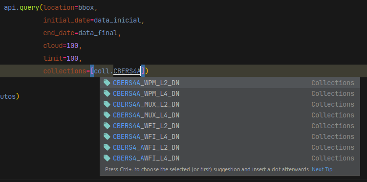

# 🛰️ cbers4asat 🇧🇷

## Descrição

Biblioteca Python para realizar a busca e processamento de imagens dos satélites CBERS-04A e AMAZONIA-1.

A biblioteca `cbers4asat` surgiu da necessidade de automatizar a busca e manipulação de imagens do satélite
sino-brasileiro CBERS-04A utilizando linguagens de programação. Posteriormente foi incluido a automação do satélite AMAZONIA-1.

O design do projeto foi inspirado no [sentinelsat](https://github.com/sentinelsat/sentinelsat), onde é possível de forma
intuitiva realizar diversas ações, como: 
- Pesquisar por imagens. 
- Baixar as imagens pesquisadas.
- Processar as imagens baixadas.

Veja todos os [exemplos de uso](https://cbers4asat.readthedocs.io/pt_BR/latest/examples/) na documentação.

> "_Python library to search and process images from the CBERS-04A and AMAZONIA-1 satellites, which provide remote 
> sensing data for the observation and monitoring of deforestation, particularly in the Amazon region, and diversified 
> agriculture throughout the national territory, with a high repetition rate, in order to act in synergy with existing 
> environmental programmes._"
>
> Text about cbers4asat from [Open Sustainable Technology Repository](https://github.com/protontypes/open-sustainable-technology).

---
[](https://pypi.python.org/pypi/cbers4asat/)
[](https://github.com/gabriel-russo/cbers4asat/blob/master/LICENSE)
[](https://pypi.python.org/pypi/cbers4asat/)
[](https://pypi.python.org/pypi/cbers4asat/)
[](https://github.com/psf/black)
[](https://github.com/pypa/hatch)


[](https://cbers4asat.readthedocs.io/pt_BR/latest/?badge=latest)
> [Read this README in english (old version of docs)](https://github.com/gabriel-russo/cbers4asat/blob/master/en-US_README.md)
> 🇺🇸

## Download

```
pip install cbers4asat
```

Instalação com a caixa de ferramentas

```
pip install "cbers4asat[tools]"
```

## Busque imagens com poucas linhas de código

```python
from cbers4asat import Cbers4aAPI
from datetime import date

# Inicializando a biblioteca
api = Cbers4aAPI('email@mail.com') # E-mail usado no login da plataforma https://www.dgi.inpe.br/catalogo/explore

# Área de interesse. Pode ser: bouding box, path row ou polygon.
path_row = (229, 124)

# Buscando metadados. Este exemplo utiliza o path row (órbita/ponto). 
# Consulte a órbita/ponto: http://www.obt.inpe.br/OBT/assuntos/catalogo-cbers-amz-1
produtos = api.query(location=path_row,
                     initial_date=date(2021, 6, 1),
                     end_date=date(2021, 7, 1),
                     cloud=100,
                     limit=10,
                     collections=['CBERS4A_WPM_L4_DN'])

# Exibindo os resultados
print(produtos)
```

## Desenvolvimento amigável

Biblioteca com tipagem, documentações e classes de apoio para uma melhor experiência de desenvolvimento.

```python
from cbers4asat import Collections as coll
```



## Utilize a caixa de ferramenta para os trabalhos mais comuns

```python
# Para ver todas as ferramentas disponíveis, verifique a documentação
from cbers4asat.tools import rgbn_composite
from rasterio.plot import show
import rasterio as rio

# Criando a composição cor verdadeira
rgbn_composite(red='./CBERS4A_WPM22812420210704/CBERS_4A_WPM_20210704_228_124_L4_BAND3.tif',
               green='./CBERS4A_WPM22812420210704/CBERS_4A_WPM_20210704_228_124_L4_BAND2.tif',
               blue='./CBERS4A_WPM22812420210704/CBERS_4A_WPM_20210704_228_124_L4_BAND1.tif',
               nir='./CBERS4A_WPM22812420210704/CBERS_4A_WPM_20210704_228_124_L4_BAND4.tif',
               filename='CBERS4A_WPM22812420210704_TRUE_COLOR.tif',
               outdir='./STACK')

# Plotando a imagem
raster = rio.open("./STACK/CBERS4A_WPM22812420210704_TRUE_COLOR.tif")

show(raster)
```

## Documentação

Você pode ler a documentação da biblioteca no link abaixo

> https://cbers4asat.readthedocs.io/

## TCC

Esse projeto foi meu objeto de estudo do Trabalho de Conclusão de Curso (TCC) no curso de Bacharelado em Ciência da Computação, você
pode visualizar o PDF neste Link:

[Repositório Institucional da Universidade Federal de Rondônia](https://ri.unir.br/jspui/handle/123456789/4345)

## Contribuição

Convido qualquer pessoa a participar contribuindo com código, relatando bugs,
escrevendo documentação, criando tutoriais e discutindo o futuro deste projeto.

Para mais informações de como contribuir ao projeto,
leia [ao manual de contribuição](https://github.com/gabriel-russo/cbers4asat/blob/master/CONTRIBUTING.md)

## Progresso do projeto

Você pode acompanhar todo o progresso do desenvolvimento
no [painel de projetos](https://github.com/gabriel-russo/cbers4asat/projects)

# Licença

Copyright (c) 2025 Gabriel Russo

Copyright (c) 2020 Sandro Klippel

O uso é fornecido sob a Licença do MIT. Veja
em [LICENSE](https://github.com/gabriel-russo/cbers4asat/blob/master/LICENSE)
para mais detalhes.
