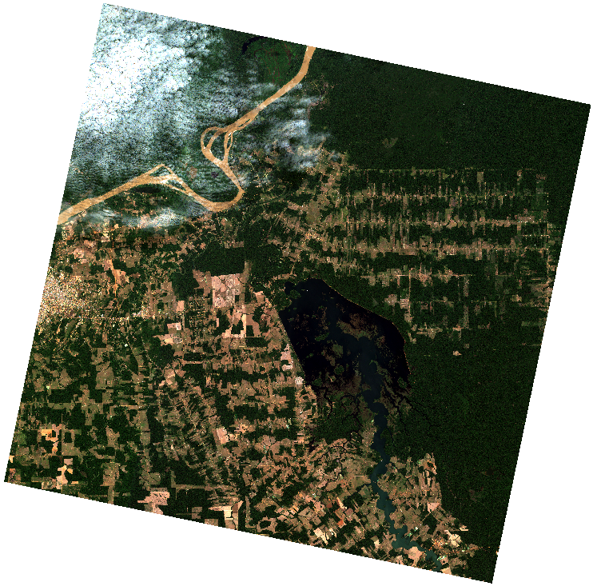

# Exemplos

<!-- TOC -->
* [Exemplos](#exemplos)
  * [Projetos que utilizam a biblioteca `cbers4asat`:](#projetos-que-utilizam-a-biblioteca-cbers4asat)
    * [1 - Mosaico de imagens do Estado de Rondônia automatizado.](#1-mosaico-de-imagens-do-estado-de-rondonia-automatizado)
    * [2 - Baixar a cena mais recente do Rio Madeira (RO), criar composição RGB e gerar XYZ tiles.](#2-baixar-a-cena-mais-recente-do-rio-madeira-ro-criar-composicao-rgb-e-gerar-xyz-tiles)
  * [Buscando produtos com Bounding Box](#buscando-produtos-com-bounding-box)
  * [Buscando produtos com órbita e ponto](#buscando-produtos-com-orbita-e-ponto)
  * [Buscando produtos com órbita e ponto utilizando o Enum Collections](#buscando-produtos-com-orbita-e-ponto-utilizando-o-enum-collections)
  * [Buscando produtos com órbita e ponto utilizando strings e Enum Collections](#buscando-produtos-com-orbita-e-ponto-utilizando-strings-e-enum-collections)
  * [Buscando produtos com geometria](#buscando-produtos-com-geometria)
  * [Buscando produtos por ID](#buscando-produtos-por-id)
  * [Download de produtos](#download-de-produtos)
  * [Download de produtos com seus respectivos metadados](#download-de-produtos-com-metadados-xml)
  * [Converter coleção de produtos para GeoDataFrame](#converter-colecao-de-produtos-para-geodataframe)
  * [Download de produtos no GeoDataFrame](#download-de-produtos-no-geodataframe)
  * [Empilhamento de bandas](#empilhamento-de-bandas)
    * [Resultado do empilhamento de bandas](#resultado-do-empilhamento-de-bandas)
  * [Pansharpening](#pansharpening)
    * [Resultado do pansharpening](#resultado-do-pansharpening)
  * [Download do grid do cbers4a ou amazonia1](#download-do-grid-do-cbers4a-ou-amazonia1)
  * [Recortando raster a partir de uma máscara - GeoJSON](#recortando-raster-a-partir-de-uma-mascara-geojson)
  * [Recortando raster a partir de uma máscara - GeoDataFrame](#recortando-raster-a-partir-de-uma-mascara-geodataframe)
<!-- TOC -->

## Projetos que utilizam a biblioteca `cbers4asat`:
> Caso você tenha um projeto que utiliza a biblioteca, faça um pull request modificando docs/examples.md ou me envie um 
email para adicioná-lo aqui. gabrielrusso@protonmail.com

### 1 - Mosaico de imagens do Estado de Rondônia automatizado.
 - [gabriel-russo/mosaico-cbers4a](https://github.com/gabriel-russo/mosaico-cbers4a)

### 2 - Baixar a cena mais recente do Rio Madeira (RO), criar composição RGB e gerar XYZ tiles.
 - [gabriel-russo/monitoramento-rio-madeira](https://github.com/gabriel-russo/monitoramento-rio-madeira)

## Buscando produtos com Bounding Box

```python
# Importar biblioteca do cbers4asat e datetime
from cbers4asat import Cbers4aAPI
from datetime import date

# (Requisito apenas para download) 
# Login utilizado no http://www.dgi.inpe.br/catalogo/explore
# Pode ser adicionado depois com o setter: api.user('meu@email.com')
api = Cbers4aAPI('seu.login@email.com')

# Bouding Box escolhido
#   O bounding box é formado por 4 coordenadas: [x_min, y_min, x_max, y_max],
#   correspondendo respectivamente a: [oeste, sul, leste, norte].
#   Sendo essa ordem um fator importante para o funcionamento da busca
bbox = [-63.92944335937501, # Oeste
        -8.819260401678381, # Sul
        -63.79211425781251, # Leste
        -8.722218306198739] # Norte

# Intervalo de data para a busca
data_inicial = date(2021, 8, 25)
data_final = date(2021, 9, 25)

# Fazer uma busca no catálogo e exibir resultados
produtos = api.query(location=bbox,
                     initial_date=data_inicial,
                     end_date=data_final,
                     cloud=100,
                     limit=100,
                     collections=['AMAZONIA1_WFI_L2_DN', 'CBERS4A_WPM_L4_DN'])  # Opcional

print(produtos)
# {'type': 'FeatureCollection', 'features': [{'type': 'Feature', 'id': 'AMAZONIA1_WFI03901620210911CB11', ...
```

## Buscando produtos com órbita e ponto

```python
from cbers4asat import Cbers4aAPI
from datetime import date

api = Cbers4aAPI('seu.login@email.com')

# Órbita ponto (respectivamente) escolhida
path_row = (229, 124)

data_inicial = date(2021, 8, 25)
data_final = date(2021, 9, 25)

produtos = api.query(location=path_row,
                     initial_date=data_inicial,
                     end_date=data_final,
                     cloud=100,
                     limit=100,
                     collections=['AMAZONIA1_WFI_L2_DN', 'CBERS4A_WPM_L4_DN'])

print(produtos)
# {'type': 'FeatureCollection', 'features': [{'type': 'Feature', 'id': 'CBERS4A_WPM22912420210830', ...
```

## Buscando produtos com órbita e ponto utilizando o Enum Collections

```python
from cbers4asat import Cbers4aAPI, Collections as coll
from datetime import date

api = Cbers4aAPI("seu.login@email.com")

path_row = (229, 124)

data_inicial = date(2021, 8, 25)
data_final = date(2021, 9, 25)

produtos = api.query(
    location=path_row,
    initial_date=data_inicial,
    end_date=data_final,
    cloud=100,
    limit=100,
    collections=[coll.CBERS4A_WPM_L2_DN, coll.CBERS4A_WPM_L4_DN],
)

print(produtos)
```

## Buscando produtos com órbita e ponto utilizando strings e Enum Collections

```python
from cbers4asat import Cbers4aAPI, Collections as coll
from datetime import date

api = Cbers4aAPI("seu.login@email.com")

path_row = (229, 124)

data_inicial = date(2021, 8, 25)
data_final = date(2021, 9, 25)

produtos = api.query(
    location=path_row,
    initial_date=data_inicial,
    end_date=data_final,
    cloud=100,
    limit=100,
    collections=[coll.CBERS4A_WPM_L2_DN, "CBERS4A_WPM_L4_DN"],
)

print(produtos)
```

## Buscando produtos com geometria

```python
from cbers4asat import Cbers4aAPI
from datetime import date
from shapely.geometry import Polygon

api = Cbers4aAPI('seu.login@email.com')

# A geometria deve ser do tipo Polygon, caso seja do tipo MultiPolygon, deve
# utilizar o método "unary_union" para converter de MultiPolygon -> Polygon

bbox = Polygon(
    [
        [-63.911934, -8.738337],
        [-63.912621, -8.805859],
        [-63.912621, -8.805859],
        [-63.798294, -8.738337],
    ]
)

data_inicial = date(2021, 8, 25)
data_final = date(2021, 9, 25)

produtos = api.query(location=bbox,
                     initial_date=data_inicial,
                     end_date=data_final,
                     cloud=100,
                     limit=1,
                     collections=['CBERS4A_WPM_L4_DN'])

print(produtos)
# {'type': 'FeatureCollection', 'features': [{'type': 'Feature', 'id': 'CBERS4A_WPM22912420210830', ...
```

## Buscando produtos por ID

```python
from cbers4asat import Cbers4aAPI

api = Cbers4aAPI('meu@email.com')

# Nota: após a versão 0.7 você deve especificar a coleção que a imagem pertence,
#   segue a mesma lógica da função query

# Nota2: Não é possível misturar coleções neste método

# Buscando pelo ID de uma cena
produto = api.query_by_id(scene_id='CBERS4A_WPM22912420210830', collection="CBERS4A_WPM_L4_DN")


print(produto)

# Para mais de um produto:

produtos = api.query_by_id(scene_id=['CBERS4A_WPM22912420210830', 'CBERS4A_WPM22912420220706'], collection="CBERS4A_WPM_L4_DN")

print(produtos)

```

## Download de produtos

```python
from cbers4asat import Cbers4aAPI
from datetime import date

api = Cbers4aAPI('seu.login@email.com')

path_row = (229, 124)

data_inicial = date(2021, 8, 25)
data_final = date(2021, 9, 25)

produtos = api.query(location=path_row,
                     initial_date=data_inicial,
                     end_date=data_final,
                     cloud=100,
                     limit=1,
                     collections=['CBERS4A_WPM_L4_DN'])

# Bandas escolhidas: vermelha, verde e azul
# Output do download é opcional e caso omitido será usado o diretório atual
api.download(products=produtos,
             bands=['red', 'green', 'blue'],
             threads=3,  # Numero de downloads simultâneos
             outdir='./downloads',
             with_folder=True)  # Agrupar bandas de uma cena(s) em subpasta(s) no diretório ./downloads

# O diretório downloads ficará assim com o with_folder=true :
# downloads/
# +- CBERS4A_WPM22912420210830/
# ++- CBERS_4A_WPM_20210830_229_124_L4_BAND3.tif
# ++- CBERS_4A_WPM_20210830_229_124_L4_BAND2.tif
# ++- CBERS_4A_WPM_20210830_229_124_L4_BAND1.tif
```

## Download de produtos com Metadados XML

```python
from cbers4asat import Cbers4aAPI
from datetime import date

api = Cbers4aAPI('seu.login@email.com')

path_row = (229, 124)

data_inicial = date(2021, 8, 25)
data_final = date(2021, 9, 25)

produtos = api.query(location=path_row,
                     initial_date=data_inicial,
                     end_date=data_final,
                     cloud=100,
                     limit=1,
                     collections=['CBERS4A_WPM_L4_DN'])

# Bandas escolhida: vermelha. Junto com seu respectivo metadado em XML.
# Download de metadados das cenas é opcional.
api.download(products=produtos,
             bands=['red'],
             threads=3,
             outdir='./downloads',
             with_folder=True,
             with_metadata=True # Baixar com metadados
             )

# Resultado:
#
# downloads/
# +- CBERS4A_WPM22912420210830/
# ++- CBERS_4A_WPM_20210830_229_124_L4_BAND3.tif
# ++- CBERS_4A_WPM_20210830_229_124_L4_BAND3.xml
```

## Converter coleção de produtos para GeoDataFrame

```python
from cbers4asat import Cbers4aAPI
from datetime import date
import geopandas as gpd

api = Cbers4aAPI('seu.login@email.com')

path_row = (229, 124)

data_inicial = date(2021, 8, 25)
data_final = date(2021, 9, 25)

produtos = api.query(location=path_row,
                     initial_date=data_inicial,
                     end_date=data_final,
                     cloud=100,
                     limit=3,
                     collections=['CBERS4A_WPM_L4_DN'])

# Converter os produtos para GeoDataFrame
gdf = api.to_geodataframe(produtos, 'EPSG:4674')

print(gdf.to_string())
```

## Download de produtos no GeoDataFrame

```python
from cbers4asat import Cbers4aAPI
from datetime import date
import geopandas as gpd

api = Cbers4aAPI('seu.login@email.com')

bbox = [-63.92944335937501,
        -8.819260401678381,
        -63.79211425781251,
        -8.722218306198739]

data_inicial = date(2021, 8, 25)
data_final = date(2021, 9, 25)

produtos = api.query(location=bbox,
                     initial_date=data_inicial,
                     end_date=data_final,
                     cloud=100,
                     limit=3,
                     collections=['CBERS4A_WPM_L4_DN'])

gdf = api.to_geodataframe(produtos)

# Utiliza a mesma lógica que o download de produtos no formato dicionário
api.download(products=gdf, bands=['red'], outdir='./downloads', with_folder=False)
```

## Empilhamento de bandas

```python
from cbers4asat.tools import rgbn_composite
import rasterio as rio
from rasterio.plot import show

# Criando uma composição COR VERDADEIRA

# Cada parâmetro de cor representa o canal da imagem de saída

# Banda NIR é opcional
rgbn_composite(red='./CBERS4A_WPM22812420210704/CBERS_4A_WPM_20210704_228_124_L4_BAND3.tif',
               green='./CBERS4A_WPM22812420210704/CBERS_4A_WPM_20210704_228_124_L4_BAND2.tif',
               blue='./CBERS4A_WPM22812420210704/CBERS_4A_WPM_20210704_228_124_L4_BAND1.tif',
               nir='./CBERS4A_WPM22812420210704/CBERS_4A_WPM_20210704_228_124_L4_BAND4.tif',
               filename='CBERS4A_WPM22812420210704_TRUE_COLOR.tif',
               outdir='./STACK')

raster = rio.open("./STACK/CBERS4A_WPM22812420210704_TRUE_COLOR.tif")

show(raster.read(), transform=raster.transform)
```

### Resultado do empilhamento de bandas



## Pansharpening

```python
from cbers4asat.tools import pansharpening
import rasterio as rio
from rasterio.plot import show

# ATENÇÃO ================================
#
# O algoritmo do pansharpening utiliza uma grande quantidade de memória RAM,
# sendo proporcional ao tamanho da imagem pancromática.
#
# ========================================

pansharpening(
    panchromatic="./CBERS4A_WPM22312920210829/CBERS_4A_WPM_20210829_223_129_L4_BAND0.tif",
    multispectral="./MULTISPECTRAL.tif",
    filename="PANSHARP.tif",
    outdir="./OUTPUT",
)

raster = rio.open("./OUTPUT/PANSHARP.tif")

show(raster)
```

### Resultado do pansharpening


## Download do grid do cbers4a ou amazonia1

```python
from cbers4asat.tools import grid_download

# Download do grid: CBERS-04A WFI
grid_download(satellite='cbers4a', sensor='wfi')

# Download do grid: CBERS-04A MUX
grid_download(satellite='cbers4a', sensor='mux')

# Download do grid: AMAZONIA-1 WFI
grid_download(satellite='amazonia', sensor='wfi')
```

## Recortando raster a partir de uma máscara - GeoJSON

```python
from cbers4asat.tools import clip, read_geojson

geo = read_geojson("area_de_interesse.geojson")

clip(
    raster="./downloads/BANDA_3.tif",
    mask=geo,
    outdir="./recortados",
    filename="BANDA_3_CLIP.tif",
)
```

## Recortando raster a partir de uma máscara - GeoDataFrame

```python
from cbers4asat.tools import clip
import geopandas as gpd

gdf = gpd.read_file("area_de_interesse.shp")

geo = gdf.geometry[0] # Pega a primeira geometria do GeoDataFrame

clip(
    raster="./downloads/BANDA_3.tif",
    mask=geo,
    outdir="./recortados",
    filename="BANDA_3_CLIP.tif",
)
```
