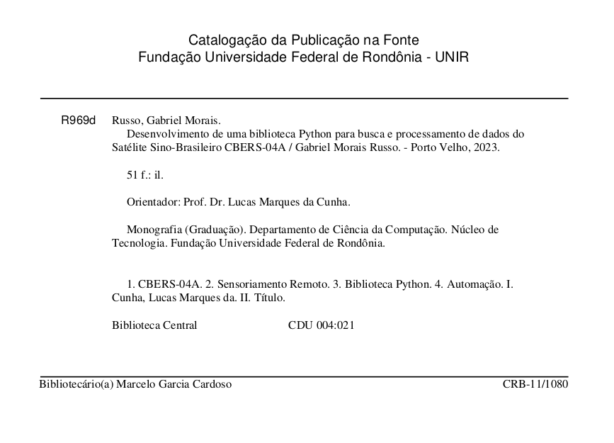

# cbers4asat

Biblioteca Python para realizar a busca e processamento de imagens dos satélites CBERS-04A e AMAZONIA-1.

## Sumário

* [Instalação](installation.md)
* [Guia de usuário](quickstart.md)
* [Documentação](api_reference.md)
* [Exemplos básicos](examples.md)

## Descrição do projeto

A biblioteca `cbers4asat` surgiu da necessidade de automatizar a busca e manipulação de imagens do satélite 
sino-brasileiro CBERS-04A utilizando linguagens de programação. Posteriormente foi incluido a automação do satélite AMAZONIA-1.

O design do projeto foi inspirado no [sentinelsat](https://github.com/sentinelsat/sentinelsat), onde é possível de forma
intuitiva, pesquisar por imagens e realizar o download com poucas linhas de código, além de poder, ser integrado com
outras bibliotecas como o geopandas.

Com essa biblioteca você pode:
- Pesquisar por imagens. 
- Baixar as imagens pesquisadas.
- Processar as imagens baixadas.

A base de dados que está sendo utilizada pertence à Divisão de Geração de Imagens do Instituto Nacional de Pesquisa
Especial (DGI-INPE). E sendo consumida através da aplicação REST
API [SpatioTemporal Asset Catalogs](https://stacspec.org/en/).

## TCC

Esse projeto foi meu objeto de estudo do Trabalho de Conclusão de Curso (TCC) no curso de Bacharelado em Ciência da Computação, você
pode visualizar o PDF neste Link:

[Repositório Institucional da Universidade Federal de Rondônia](https://ri.unir.br/jspui/handle/123456789/4345)

TCC PDF Backup:

[TCC_Gabriel_Russo-completo.pdf](https://github.com/gabriel-russo/cbers4asat/tree/master/docs/research/TCC_Gabriel_Russo-completo.pdf)
