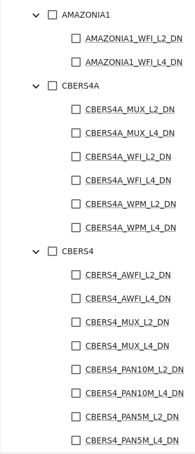

# Guia de usuário

## Introdução

A biblioteca `cbers4asat` utiliza primáriamente a classe `Cbers4aAPI` para realizar todas as operações no catálogo de
imagens do CBERS-04A e AMAZONIA-1.

Dessa forma, cria-se inicialmente uma instância dessa classe e utiliza-se os métodos do objeto.

**É necessário possuir um cadastro na [plataforma](http://www2.dgi.inpe.br/catalogo/explore)**

```python
# Importar biblioteca do cbers4asat
from cbers4asat import Cbers4aAPI

# A classe date é utilizada para padronizar o formato de data na biblioteca
from datetime import date

# Instanciando o objeto com o usuário cadastrado na plataforma
api = Cbers4aAPI('seu.login@email.com')

# Bouding Box escolhido
bbox = [-63.92944335937501,
        -8.819260401678381,
        -63.79211425781251,
        -8.722218306198739]

# Intervalo de data para a busca
data_inicial = date(2021, 8, 25)
data_final = date(2021, 9, 25)

# Fazer uma busca no catálogo e exibir resultados
produtos = api.query(location=bbox,
                     initial_date=data_inicial,
                     end_date=data_final,
                     cloud=100,
                     limit=100,
                     collections=['AMAZONIA1_WFI_L2_DN', 'CBERS4A_WPM_L4_DN'])  # Opcional

print(produtos)
# {'type': 'FeatureCollection', 'features': [{'type': 'Feature', 'id': 'AMAZONIA1_WFI03901620210911CB11', ...
```

O retorno da busca (`query`) é um GeoJSON com todos os itens encontrados da coleção especificada.

Nota-se que o GeoJSON possui [propriedades específicas da biblioteca STAC](https://stacspec.org/en/about/stac-spec/)

Caso queira trabalhar com os resultados utilizando o `geopandas` (recomendado), adicione essa linha de código após a
busca:

```
gdf = api.to_geodataframe(produtos, 'EPSG:4674')
```

## Autenticação

Para baixar imagens, é necessário autenticar-se no `cbers4asat` com o mesmo login da plataforma da DIVISÃO DE
GERAÇÃO DE IMAGENS - INPE.

Caso não possua login, realize o cadastro no site:

[http://www2.dgi.inpe.br/catalogo/explore](http://www2.dgi.inpe.br/catalogo/explore)

## Coleções de imagens

As coleções disponíveis para uso no método `query` pode ser encontrado
no [mesmo site que é feito a autenticação](http://www2.dgi.inpe.br/catalogo/explore). Porém você pode utilizar a colinha
abaixo:


