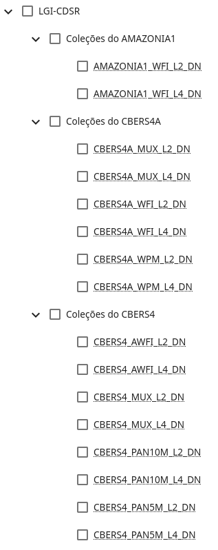

# Guia de usuário

## Introdução

A biblioteca `cbers4asat` utiliza primáriamente a classe `Cbers4aAPI` para realizar todas as operações no catálogo de
imagens do CBERS-04A e AMAZONIA-1.

Dessa forma, cria-se inicialmente uma instância dessa classe e utiliza-se os métodos do objeto.

**É necessário possuir um cadastro na [plataforma Explorer do DGI-INPE](https://www.dgi.inpe.br/catalogo/explore)**

```python
# Importar biblioteca do cbers4asat
from cbers4asat import Cbers4aAPI

# A classe date é utilizada para padronizar o formato de data na biblioteca
from datetime import date

# Instanciando o objeto com o usuário cadastrado na plataforma
api = Cbers4aAPI('seu.login@email.com')

# Bouding Box escolhido
#   O bounding box é formado por 4 coordenadas: [x_min, y_min, x_max, y_max],
#   correspondendo respectivamente a: [oeste, sul, leste, norte].
#   Sendo essa ordem um fator importante para o funcionamento da busca
bbox = [-63.92944335937501, # Oeste
        -8.819260401678381, # Sul
        -63.79211425781251, # Leste
        -8.722218306198739] # Norte

# Intervalo de data para a busca
data_inicial = date(2021, 8, 25)
data_final = date(2021, 9, 25)

# Fazer uma busca no catálogo e exibir resultados
produtos = api.query(location=bbox,
                     initial_date=data_inicial,
                     end_date=data_final,
                     cloud=100,
                     limit=100,
                     collections=['AMAZONIA1_WFI_L2_DN', 'CBERS4A_WPM_L4_DN']) # Explicação sobre as coleções nos próximos itens abaixo.

print(produtos)
# {'type': 'FeatureCollection', 'features': [{'type': 'Feature', 'id': 'AMAZONIA1_WFI03901620210911CB11', ...
```

O retorno da busca (`query`) é um `GeoJSON` com todos os itens encontrados da coleção especificada.

Nota-se que o GeoJSON possui [propriedades específicas da biblioteca STAC](https://stacspec.org/en/about/stac-spec/)

Para filtrar e/ou transformar os resultados é recomendado a utilização do `geopandas`, adicione essa linha de código após a
busca para fazer a conversão de dicionário para `GeoDataFrame`:

```
gdf = api.to_geodataframe(produtos)
```

A saída é um `GeoDataFrame` com o SRC EPSG:4326.

## Autenticação para o download das imagens.

Para baixar imagens, é necessário autenticar-se no `cbers4asat` com o mesmo login da plataforma Explorer da DIVISÃO DE
GERAÇÃO DE IMAGENS - INPE.

Caso não possua login, realize o cadastro no site:

[http://www.dgi.inpe.br/catalogo/explore](https://www.dgi.inpe.br/catalogo/explore)

## Coleções de imagens

A biblioteca `cbers4asat` tem suporte apenas para as coleções contidas na fonte `LGI-CDSR`, como mostra a imagem mais abaixo.

As coleções disponíveis para uso no método `query` pode ser encontrado 
no [mesmo site que é feito a autenticação](https://www.dgi.inpe.br/catalogo/explore), na aba "Dados". 

Porém, você também pode utilizar a classe de apoio: `Collections`, disponibilizada pela biblioteca. 

```python
from cbers4asat import Cbers4aAPI, Collections as coll
from datetime import date

api = Cbers4aAPI("seu.login@email.com")

path_row = (229, 124)

data_inicial = date(2021, 8, 25)
data_final = date(2021, 9, 25)

produtos = api.query(
    location=path_row,
    initial_date=data_inicial,
    end_date=data_final,
    cloud=100,
    limit=100,
    collections=[coll.CBERS4A_WPM_L2_DN, coll.CBERS4A_WPM_L4_DN],
)

print(produtos)
```
Dessa forma, ao utilizar uma IDE em conjunto com essa funcionalidade, você ganha agilidade e segurança
para não digitar o nome de uma coleção equivocadamente.


Esse recurso é opcional e também pode "misturar" com strings, já que são apenas Enums de string.

Caso queira utilizar apenas `strings` em seu código, utilize a imagem abaixo como consulta para digitar os nomes
corretamente:


